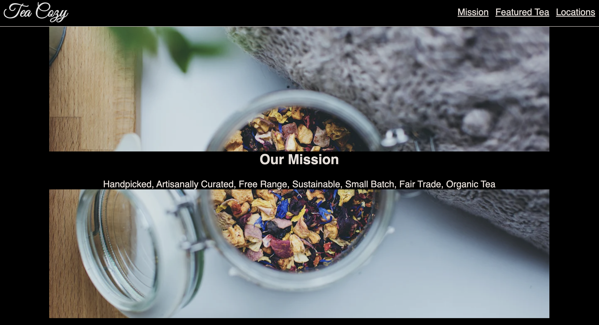

# Tea-Cozy

<h1 align="center">
   
  
</h1>

<h4 align="center">Tea Cozy</h4>

  <a href="#About">About</a> •
  <a href="#license">License</a>

## About

This is a an off-platform project from codecademy to practice HTML and CSS basics such as the box-model, selectors, positioning, and flexbox. This is my attempt at recreating a website from a <a href="https://content.codecademy.com/courses/freelance-1/unit-4/img-tea-cozy-redline.jpg?_gl=1*a3k1mv*_ga*Mzg1NzI0NzI0NS4xNjc0MDE3MTI2*_ga_3LRZM6TM9L*MTY3NDU4Mjg4MS4xMS4xLjE2NzQ1ODY1MDcuNDcuMC4w">design spec</a> provided by codecademy.

## Credits
I used materials such as the images from codecademy as a resource.
- [Codecademy](https://codecademy.com/)

## License

MIT

---

> GitHub [@bravlis2](https://github.com/bralvis2) &nbsp;&middot;&nbsp;

